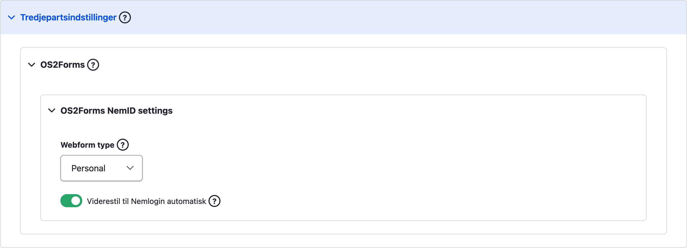
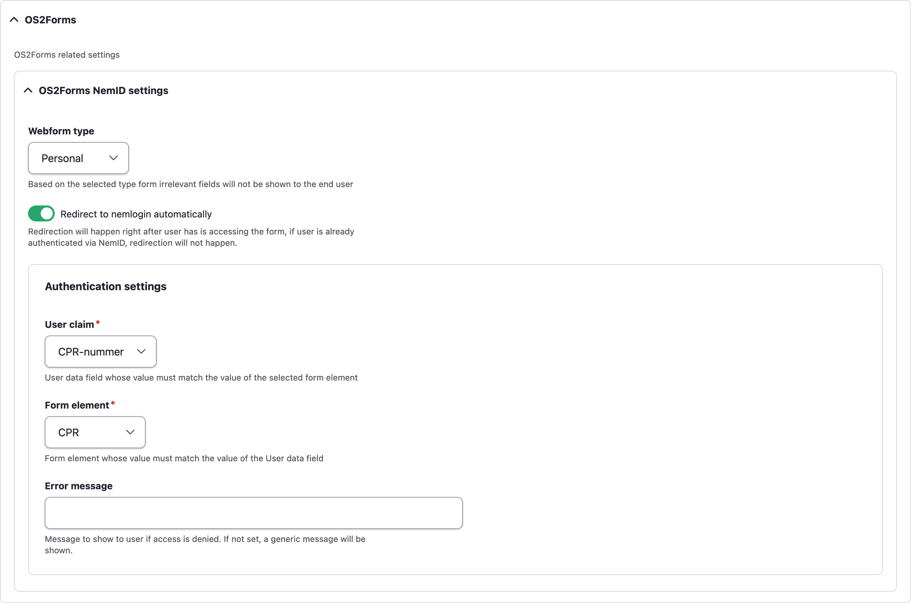

# OS2Forms NemLogin OpenID Connect

Implements an [OS2Web NemLog-in
`AuthProvider`](https://github.com/OS2web/os2web_nemlogin/blob/master/src/Annotation/AuthProvider.php),
[`OpenIDConnect`](src/Plugin/os2web/NemloginAuthProvider/OpenIDConnect.php), for
authenticating with [OpenID Connect](https://openid.net/connect/).
But allows for multiple of these to be defined eg. AD and NemLogin.

A controller,
[`OpenIDConnectController`](src/Controller/OpenIDConnectController.php), takes
care of the actual authenticating.

## Installation

```sh
composer require itk-dev/os2forms_nemlogin_openid_connect
vendor/bin/drush pm:enable os2forms_nemlogin_openid_connect
```

The module has a soft dependency on `os2forms_organisation` in the sense that
the `OrganisationEventSubscriber` only will be initialized if the
`os2forms_organisation` module is installed. See the comments in
`OrganisationEventSubscriber::getSubscribedEvents`.

## Configuration

Go to `/admin/os2forms_nemlogin_openid_connect/settings` to set up providers, eg.

```yaml
openid_connect_nemlogin: OpenIDConnect Nemlogin
openid_connect_ad: OpenIDConnect AD
```

and then go to `/admin/config/system/os2web-nemlogin/«id»` to set up the OpenID
Connect configuration.

You should then see the provider having status `OK` on
`/admin/config/system/os2web-nemlogin`.

## Use on a webform

Edit a webform, go to Settings > Third Party Settings > OS2Forms > OS2Forms NemID
settings and specify “Webform type”:



## Authentication settings

When “Webform type” is specified it’s possible to add an authentication check on
the form by requiring the value of a field (pre-filled with a value from a
previous submission) to match the value of a specified user property.

Before using authentication checks, “User claims” available for the checks must
be defined on `/admin/config/system/os2web-nemlogin/«id»`.

Edit a webform, go to Settings > Third Party Settings > OS2Forms > OS2Forms
NemID settings > Authentication settings and define which “User claim” value
must match a “Form element” value:



Note: The authentication check sits on top of the other access checks in
OS2Forms, i.e. it does not itself grant access, but adds additional requirements
that must be fulfilled before a user can fill in a form.

## Local test

Authenticating with local test users can be enabled in `settings.local.php`:

```php
// Enable local test mode
$settings['os2forms_nemlogin_openid_connect']['local_test_mode'] = TRUE;

// Define local test users
//   User id => user info (claims)
$settings['os2forms_nemlogin_openid_connect']['local_test_users'] = [
  '1234567890' => [
    'cpr' => '1234567890',
    'name' => 'John Doe',
  ],
  'another-user' => [
    …
  ],
];

// Override settings for specific plugins:
$settings['os2forms_nemlogin_openid_connect']['my-plugin-id']['local_test_mode'] = FALSE;

// Define local test users
//   User id => user info (claims)
$settings['os2forms_nemlogin_openid_connect']['another-plugin-id']['local_test_users'] = [
  'user087' => [
    'id' => 'user087',
    'name' => 'User 87',
  ],
];
```

## Coding standards

Our coding are checked by GitHub Actions (cf. [.github/workflows/pr.yml](.github/workflows/pr.yml)). Use the commands
below to run the checks locally.

### PHP

```shell
docker run --rm --volume ${PWD}:/app --workdir /app itkdev/php8.1-fpm composer install
# Fix (some) coding standards issues
docker run --rm --volume ${PWD}:/app --workdir /app itkdev/php8.1-fpm composer coding-standards-apply
# Check that code adheres to the coding standards
docker run --rm --volume ${PWD}:/app --workdir /app itkdev/php8.1-fpm composer coding-standards-check
```

### Markdown

```shell
docker run --rm --volume $PWD:/md peterdavehello/markdownlint markdownlint --ignore vendor --ignore LICENSE.md '**/*.md' --fix
docker run --rm --volume $PWD:/md peterdavehello/markdownlint markdownlint --ignore vendor --ignore LICENSE.md '**/*.md'
```

## Code analysis

We use [PHPStan](https://phpstan.org/) for static code analysis.

Running statis code analysis on a standalone Drupal module is a bit tricky, so we use a helper script to run the
analysis:

```shell
docker run --rm --volume ${PWD}:/app --workdir /app itkdev/php8.1-fpm ./scripts/code-analysis
```
